# AudienceDecode

**Team:**
- Arianna Cambi
- Sofia Capriolo
- Andrea Cipolla
- Giorgio Vanini

*Machine Learning, LUISS Guido Carli University, 2025/2026*

---

## Section 1: Introduction

AudienceDecode analyzes viewer engagement and content dynamics within a large-scale streaming platform using the `viewer_interactions.db` dataset, which contains approximately 4 million anonymized user-movie interactions spanning 434,429 users and 16,013 movies. Each interaction includes a rating on a **7-point scale (0-6, where 0=lowest, 6=highest)**, timestamp, and associated metadata. Rather than predicting individual ratings, this project focuses on uncovering behavioral patterns through unsupervised learning to segment audiences and content into interpretable categories.

We perform clustering separately on two engineered feature sets: **user engagement profiles** (total ratings given, average rating, rating variability, rating consistency, activity duration) and **movie reception profiles** (total ratings received, Bayesian-adjusted average rating, rating dispersion, rating range). Using systematic evaluation across k in [3, 9], we identify **k=6 user segments** and **k=3 movie categories** through centroid silhouette analysis and elbow method consensus. We then select **MiniBatch K-Means** as the optimal algorithm by comparing cluster quality, balance, and computational efficiency across the three methods.

By combining these segmentations, we construct a **6x3 user-cluster x movie-cluster preference matrix**, where each cell represents the bias-corrected, quality-weighted affinity between an audience segment and a content category. This dual-clustering framework reveals structured preference patterns, such as which user types favor mainstream popular content versus niche or marginal titles, without requiring labeled training data.

This approach offers three key advantages over traditional collaborative filtering:

1. **Interpretability**: Cluster centroids provide explicit behavioral profiles (e.g., "moderate viewers" vs "peak engagement users") rather than latent factors.
2. **Scalability**: Aggregated statistics reduce dimensionality from 100M interactions to approximately 440K samples, enabling efficient computation.
3. **Cold-start robustness**: New users and movies can be assigned to clusters based on initial statistics without requiring extensive interaction history.

The resulting insights support data-driven content curation, recommendation strategy design, and audience segmentation for targeted marketing campaigns.

---

## Section 2: Methods

### Dataset and Features

The dataset `viewer_interactions.db` is a relational SQLite database containing four tables:

- **viewer_ratings**: Interaction-level data (user ID, movie ID, rating 0-6, timestamp)
- **movies**: Movie metadata (movie ID, title, year of release)
- **user_statistics**: Aggregated user profiles with 5 engineered features:
  - `total_ratings`: Total number of ratings given by the user
  - `avg_rating`: Average rating value
  - `std_rating`: Standard deviation of ratings (preference variability)
  - `rating_consistency`: `avg_rating / (std_rating + epsilon)`, capturing the stability of rating behavior
  - `activity_days`: Time span between first and last rating
- **movie_statistics**: Aggregated movie profiles with 4 engineered features:
  - `total_ratings`: Total number of ratings received
  - `bayesian_avg_rating`: Bayesian-shrunk quality estimate, `(v * R + C * m) / (v + C)`, where `v` is the rating count, `R` is the raw average, `C` is the global median count, and `m` is the global mean
  - `std_rating`: Rating dispersion (polarization indicator)
  - `rating_range`: `max_rating - min_rating`, capturing whether reception is narrow (consensus) or wide (controversy)

**Feature Selection Rationale**: The raw `unique_movies` (users) and `unique_users` (movies) columns were excluded from the clustering feature sets because they correlate above 0.9 with `total_ratings`, effectively double-weighting engagement volume in the Euclidean distance metric without adding new information. Retaining them would cause the clustering to overfit to the engagement axis at the expense of behavioral and quality dimensions. Similarly, raw `avg_rating` for movies was replaced by `bayesian_avg_rating` to prevent movies with very few ratings from receiving artificially extreme quality scores. `rating_consistency` replaces the uninformative `min_rating` and `max_rating` extremes for users, capturing how stable a user's rating behavior is relative to their own mean.

### Preprocessing Pipeline

1. **Data Cleaning**:
   - Removed records with missing keys or invalid ratings (outside 0-6)
   - Filtered anomalous timestamps
   - Dropped duplicate entries
   - Imputed missing `year_of_release` with the median

2. **Feature Engineering**:
   - Reconstructed `activity_days` from `first_rating_days` and `last_rating_days` to preserve users with missing values
   - Derived `bayesian_avg_rating` and `rating_range` for movie features
   - Derived `rating_consistency` for user features
   - Capped extreme outliers (above 99th percentile) in user engagement metrics to reduce skewness

3. **Imputation and Scaling**:
   - Applied median imputation to all numeric features in statistics tables
   - Standardized features using `StandardScaler` to ensure equal contribution during clustering

### Clustering Algorithms

We evaluated three scalable centroid-based methods on both user and movie feature matrices:

1. **K-Means**: Standard Lloyd's algorithm (`n_init=10`, `max_iter=300`)
2. **MiniBatch K-Means**: Optimized for large datasets (`batch_size=10000`, `n_init=5`)
3. **BIRCH**: Tree-based incremental clustering (`threshold=0.5`, `branching_factor=50`)

**Algorithm Selection Rationale**: All three are centroid-based and scalable. K-Means serves as baseline, MiniBatch K-Means addresses computational efficiency for 400K+ users, and BIRCH tests hierarchical clustering with different sensitivity to data geometry and outliers.

### Model Selection Strategy

Our model selection process follows a two-step procedure to ensure both optimal cluster granularity and algorithm performance.

#### Step 1: Optimal k Selection

For each algorithm (K-Means, MiniBatch K-Means, BIRCH) and dataset (users/movies), we tested k in [3-9] and computed:

- **WCSS (Within-Cluster Sum of Squares)**: Compactness metric evaluated using the Elbow method to identify diminishing returns in variance reduction.
- **Centroid-Based Silhouette**: Scalable separation quality proxy measuring how well each sample fits its assigned cluster compared to neighboring clusters. Computed via a vectorized O(n log k) approximation using centroid distances rather than O(n^2) pairwise distances.

We selected the global k using a **consensus rule**:
- **If at least 2 models agreed** on the best k (by centroid silhouette), that k is adopted via **majority vote**.
- **If all 3 models suggested different k**, we choose the k with the **highest average silhouette** across all models.

For users, the three algorithms peaked at different values of k (K-Means: 3, BIRCH: 5, MiniBatch: 6), so the fallback rule applied and selected **k=6** as the value maximizing average silhouette. For movies, **k=3** was selected by consensus.

#### Step 2: Algorithm Selection

After determining the optimal k for each dataset, we ranked the three clustering algorithms using a **composite score** combining:

1. **Cluster quality**: Centroid silhouette at the optimal k (higher is better)
2. **Cluster balance**:
   - Minimum cluster size (larger is better, avoids singleton/tiny clusters)
   - Standard deviation of cluster sizes (lower is better, avoids severe imbalance)
3. **Computational efficiency**: Execution time (lower is better for scalability)

Each metric was normalized using percentile ranks and combined to produce a final ranking score. This multi-criteria approach ensures the selected model balances separation quality, interpretability (balanced clusters), and practical deployment considerations.

### Preference Matrix Construction

After identifying the optimal k for both datasets (k=6 for users, k=3 for movies), we selected **MiniBatch K-Means** as the best-performing algorithm based on its superior composite score. Using the cluster assignments from this model, we constructed the preference matrix as follows:

1. **Assigned each movie a quality score**: `0.7 * normalized(bayesian_avg_rating) + 0.3 * normalized(log(total_ratings))`. The Bayesian-adjusted rating receives higher weight to reflect that quality is more informative than raw popularity for predicting genuine preference.

2. **Computed bias-corrected cluster-level affinity** for each (user cluster, movie cluster) pair:
   - For each user cluster, we compute its overall mean rating across all movie clusters (its baseline rating tendency).
   - The **excess rating** for a pair is defined as `mean_rating(u, m) - baseline(u)`: how much more or less a user cluster rates this movie cluster relative to its own average.
   - The excess is shifted to be non-negative and multiplied by `log(1 + interaction_count)` to weight by evidence volume.
   - This correction removes rating-level bias: user clusters that systematically give high ratings would otherwise appear to prefer every movie cluster equally.

3. **Combined affinity and quality** into a final preference score using weights alpha=0.6 (user-specific affinity) and gamma=0.4 (global movie quality).

4. **Visualized the resulting preference matrix** via heatmap to identify systematic preference patterns.

### Machine Learning System Workflow

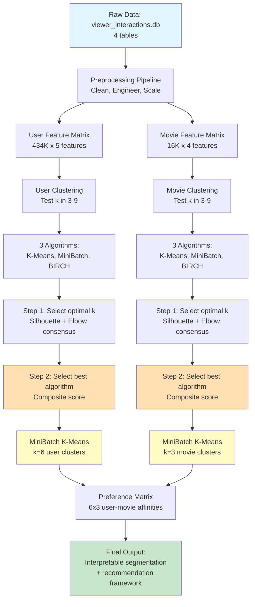

### Environment Setup

The analysis was conducted using Python 3.x with the following core dependencies:

- `numpy` 2.0.2, `pandas` 2.2.2: Data manipulation
- `scikit-learn` 1.6.1: Clustering algorithms, preprocessing, PCA
- `matplotlib` 3.10.0, `seaborn` 0.13.2: Visualization
- `sqlite3`: Database connection (standard library)

All dependencies are listed in `requirements.txt` for reproducibility.

### Design Choices Summary

- **Bayesian average rating over raw average**: Prevents movies with very few ratings from receiving extreme quality scores by shrinking estimates toward the global mean.
- **Excess-rating affinity over raw mean rating**: Removes per-cluster rating-level bias so that the preference matrix reflects genuine relative preferences rather than overall generosity.
- **Removal of correlated features**: `unique_movies` and `unique_users` were excluded to avoid double-weighting engagement volume in the distance metric.
- **Median imputation over mean**: Robust to outliers in heavily skewed distributions.
- **Capping at 99th percentile over removal**: Preserves data while reducing extreme skew effects.
- **StandardScaler**: Ensures features with different scales (e.g., `total_ratings` vs `std_rating`) contribute equally to clustering distances.
- **Centroid-based algorithms**: Chosen for scalability and interpretability on large datasets.
- **Composite scoring for model selection**: Evaluates cluster quality, cluster size distribution, and computational efficiency rather than optimizing a single metric.

---

## Section 3: Experimental Design

### Purpose

The primary goal is to identify optimal clustering configurations for both users and movies that balance three criteria: (1) separation quality (how distinct the clusters are), (2) cluster balance (avoiding tiny or singleton clusters), and (3) computational efficiency. We aim to uncover interpretable behavioral segments rather than maximize a single performance metric.

### Baselines

We compare three centroid-based clustering algorithms:

1. **K-Means**: Standard Lloyd's algorithm serving as the reference baseline.
2. **MiniBatch K-Means**: Scalable variant designed for large datasets (400K+ users).
3. **BIRCH**: Tree-based incremental clustering with different sensitivity to data geometry.

Each is evaluated across k in [3-9] to explore different granularities of segmentation.

### Evaluation Metrics

We employ a multi-metric evaluation framework:

- **WCSS (Within-Cluster Sum of Squares)**: Measures cluster compactness via the Elbow method. Lower values indicate tighter clusters.
- **Centroid-based Silhouette**: Scalable O(n log k) approximation of the standard O(n^2) Silhouette score, measuring separation quality by comparing intra-cluster cohesion to nearest-centroid distance.
- **Cluster size distribution**: Minimum cluster size and standard deviation detect severe imbalance (e.g., singleton clusters or highly skewed distributions).
- **Computation time**: Practical efficiency consideration for large-scale deployment.

**Why these metrics?** WCSS and Silhouette provide complementary views (compactness vs separation), while size distribution and time ensure the solution is practical and interpretable. We combine these into a composite ranking score to avoid over-optimizing a single dimension.

---

## Section 4: Results

### Exploratory Data Analysis

Before clustering, we analyzed the distribution of user engagement metrics and feature correlations to understand the data structure.

**Figure 1**: Distribution of user engagement metrics showing heavy-tailed behavior with most users having low activity and a small fraction showing extreme engagement.

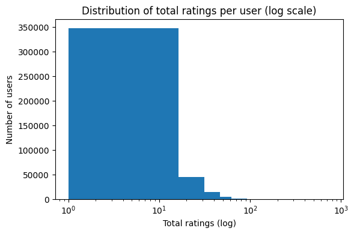

*Generated from EDA code in AudienceDecode.ipynb, Section 1.1*

---

**Figure 2**: Correlation heatmap of user features confirming a correlation of **0.97** between `total_ratings` and `unique_movies`, which motivates the removal of `unique_movies` from the clustering feature set to avoid double-weighting engagement volume.

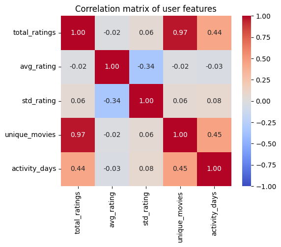

*Generated from EDA code in AudienceDecode.ipynb, Section 1.2*

---

### Model Performance Comparison

We evaluated three clustering algorithms (K-Means, MiniBatch K-Means, BIRCH) across k in [3-9] using centroid silhouette analysis and elbow method consensus. The optimal k was identified as **k=6 for users** and **k=3 for movies**. We then ranked the algorithms using the composite score described in Section 2.

**Table 1: Clustering Algorithm Comparison, Users (k=6)**

| Model             | Centroid Silhouette | Min Cluster Size | Std Cluster Size | Time (sec) | Score  |
|-------------------|---------------------|------------------|------------------|------------|--------|
| MiniBatch K-Means | 0.490               | 25,958           | 53,965           | 0.165      | 0.667  |
| BIRCH             | 0.525               | 2,424            | 137,901          | 0.149      | 0.000  |
| K-Means           | 0.489               | 25,957           | 54,056           | 0.166      | -0.667 |

**Table 2: Clustering Algorithm Comparison, Movies (k=3)**

| Model             | Centroid Silhouette | Min Cluster Size | Std Cluster Size | Time (sec) | Score  |
|-------------------|---------------------|------------------|------------------|------------|--------|
| MiniBatch K-Means | 0.505               | 3,738            | 1,390            | 0.006      | 0.333  |
| BIRCH             | 0.787               | 15               | 7,494            | 0.005      | 0.000  |
| K-Means           | 0.529               | 20               | 4,692            | 0.008      | -0.333 |

**Interpretation**: MiniBatch K-Means achieves the best overall balance between cluster quality, size distribution, and computational efficiency for both datasets. For users, it leads with a composite score of 0.667, a minimum cluster size of 25,958, and the best Silhouette among the well-balanced candidates (0.490). For movies, it again ranks first (0.333), producing the most evenly distributed clusters (minimum size 3,738, std 1,390). BIRCH attains the highest raw Silhouette in both cases but produces extremely imbalanced clusters (minimum sizes of 15 for movies and 2,424 for users), which significantly reduces interpretability and practical utility.

---

**Figure 3**: Elbow and Centroid Silhouette curves for user clustering across k in [3-9]. The three algorithms peak at different values of k (K-Means: 3, BIRCH: 5, MiniBatch K-Means: 6), so the consensus fallback rule selects k=6 as the value that maximizes the average silhouette across all models.

**K-Means:**

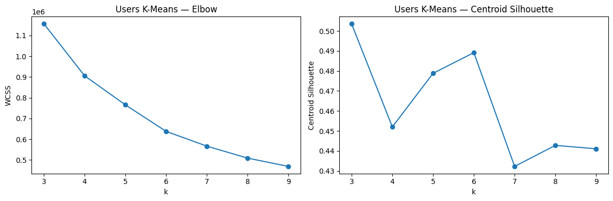

**MiniBatch K-Means:**

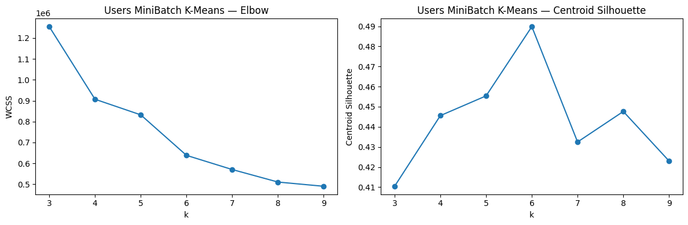

**BIRCH:**

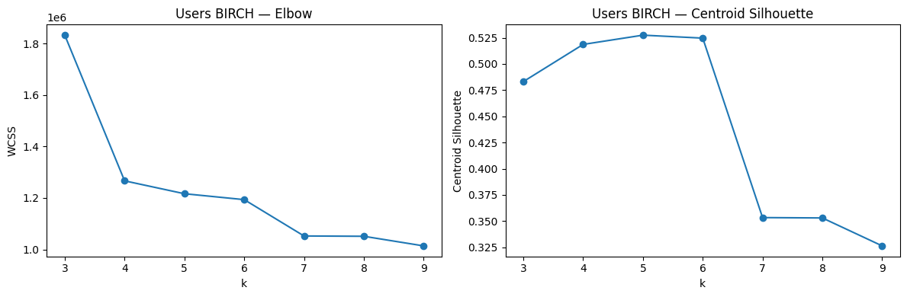

*Generated from clustering evaluation code in AudienceDecode.ipynb, Sections 4.2, 4.3, 4.4*

---

**Figure 4**: Elbow and Centroid Silhouette curves for movie clustering across k in [3-9]. The three algorithms peak at different values of k (K-Means: 9, BIRCH: 3, MiniBatch K-Means: 6), so the consensus fallback rule selects k=3 as the value that maximizes the average silhouette across all models.

**K-Means:**

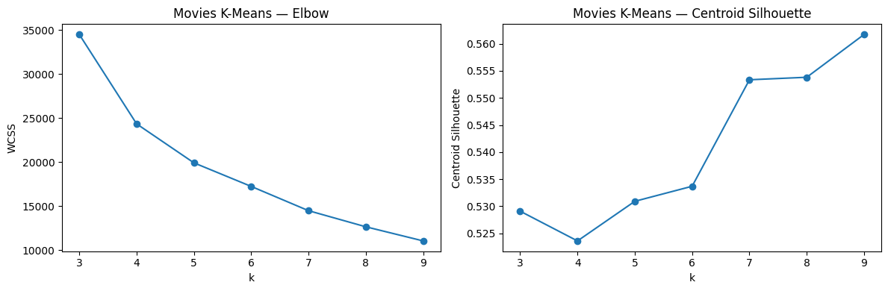

**MiniBatch K-Means:**

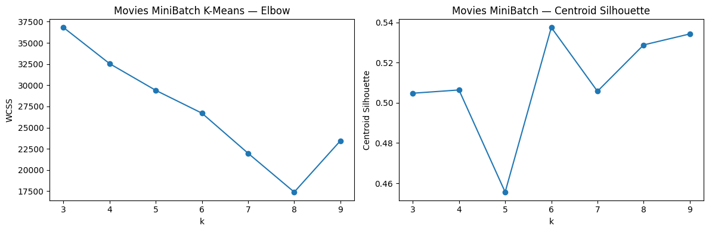

**BIRCH:**

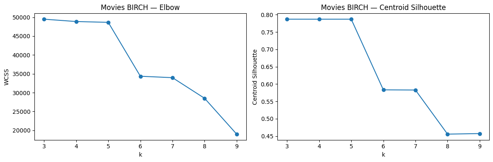

*Generated from clustering evaluation code in AudienceDecode.ipynb, Sections 5.1, 5.2, 5.3*

---

**Figure 5**: 2D PCA projection of user clusters from MiniBatch K-Means (k=6). Clusters show partial overlap in the reduced space (expected given the 5-dimensional original feature space) but maintain clear centroid separation.

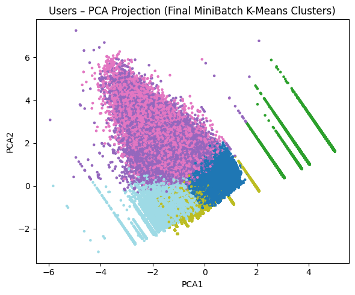

*Generated from visualization code in AudienceDecode.ipynb, Section 4.6*

---

**Figure 6**: 2D PCA projection of movie clusters from MiniBatch K-Means (k=3), visualizing content segmentation in reduced dimensional space.

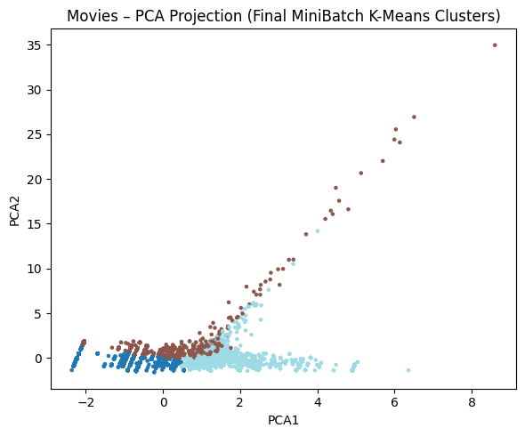

*Generated from visualization code in AudienceDecode.ipynb, Section 5.5*

---

### User Segmentation

Using the selected model (MiniBatch K-Means, k=6), we identified six distinct user behavioral profiles based on their engagement patterns and preference scores in the affinity matrix:

- **U0, Mainstream-First with marginal tolerance**: Preferences concentrate strongly on F1 (0.97) and F2 (0.65), with moderate tolerance for F0 (0.16).

- **U1, Moderate Mainstream Viewers**: Lowest overall preference intensity across all movie clusters, with F1 (0.84) and F2 (0.59) preferred and near-zero affinity for F0 (0.03).

- **U2, Mainstream-Focused, Quality-Aware**: Very high F1 alignment (0.98), moderate F2 (0.62), and strong avoidance of F0 (0.05).

- **U3, Peak Mainstream Engagement**: The strongest overall preference intensity, with F1 at its maximum (1.00), F2 (0.66), and near-zero F0 (0.03).

- **U4, Broad Content Explorers**: High F1 preference (0.91), moderate F2 (0.59), and the highest F0 tolerance of any segment (0.21).

- **U5, Selective Mainstream Viewers**: High F1 alignment (0.94), moderate F2 (0.57), and zero tolerance for F0 (0.00).

---

### Movie Segmentation

Using the selected model (MiniBatch K-Means, k=3), we identified three distinct movie categories based on reception patterns and audience reach:

- **F0, Low-Attraction Marginal Content**: Movies with consistently low Bayesian-adjusted ratings and limited audience engagement, representing niche or poorly-received content that fails to attract significant interaction volume.

- **F1, Mainstream Popular Titles**: Widely consumed movies with moderate-to-high popularity and solid quality estimates, representing commercially successful content with broad appeal across all user segments.

- **F2, Top-Quality High-Engagement Movies**: Movies combining high Bayesian-adjusted ratings with strong audience engagement, representing critically acclaimed and platform flagship content.

---

### Preference Patterns

By combining user and movie cluster assignments, we constructed a 6x3 preference matrix revealing systematic affinities between audience segments and content categories:

- **F1 (Mainstream Popular Titles)** emerges as the most consistently preferred category across all six user groups, with preference scores ranging from 0.84 to 1.00.
- **F0 (Low-Attraction Marginal Content)** is systematically avoided, with scores ranging from 0.00 to 0.21 across all segments.
- User clusters differentiate primarily in overall preference intensity and in their degree of tolerance for F0, while maintaining the same F1 > F2 >> F0 ranking order.

**Figure 7**: User-cluster x Movie-cluster preference matrix heatmap. Cell values represent preference scores combining bias-corrected cluster affinity (alpha=0.6) and Bayesian movie quality (gamma=0.4). The consistent block structure across all six user segments validates meaningful segmentation beyond random assignment.

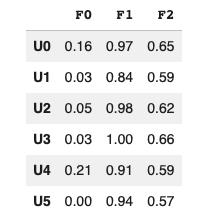

*Generated from preference analysis code in AudienceDecode.ipynb, Section 6*

---

## Section 5: Recommendation System Extension

We implemented a fully interpretable recommendation module that operationalizes the user-movie cluster structure described above (AudienceDecode.ipynb, Section 7). The goal is to demonstrate how the clustering framework supports transparent Top-N suggestions for any user in the dataset.

The system uses four inputs:

- (i) the user's assigned cluster,
- (ii) the movie cluster labels,
- (iii) a **movie quality score** (`0.7 * normalized(bayesian_avg_rating) + 0.3 * normalized(log(total_ratings))`), and
- (iv) a **cluster-level affinity matrix** capturing the bias-corrected excess preference of each user cluster for each movie cluster.

For efficiency, these values are pre-computed into lookup dictionaries (`{(user_cluster, movie_cluster): affinity}`, `{movie_id: quality}`, `{user_id: set(movies_seen)}`), enabling constant-time O(1) retrieval during scoring.

For a given user, the scoring function is:

```
score = alpha * cluster_affinity(u_cluster, m_cluster) + gamma * quality_score(movie)
alpha = 0.6,  gamma = 0.4
```

Already-seen titles are filtered out, the score is computed for all remaining candidates in a fully vectorized pass, and the **Top-10 movies are returned**. Because all inputs are directly observable, the recommendations are fully explainable: high-scoring movies belong to the cluster that the user's segment rates most above its own baseline, further refined by individual quality estimates.

---

## Section 6: Evaluation

We evaluate the recommendation system using two complementary approaches.

### Score Calibration

RMSE, MAE, and Pearson correlation compare the model's predicted preference scores against actual normalized ratings on a sample of 45,641 matched interactions (sampled from `viewer_ratings_clean`, joined with cluster and quality data).

| Metric              | Value  |
|---------------------|--------|
| RMSE                | 0.2806 |
| MAE                 | 0.2315 |
| Pearson correlation | 0.2494 |

Because the model operates at the cluster level, some irreducible error is expected: it captures behavioral patterns at the group level and cannot model within-cluster individual variation. These metrics establish a realistic calibration baseline for this type of approach.

### Ranking Quality

Precision@k, Recall@k, and Hit Rate@k are computed on a temporal hold-out split. For each user, the most recent 20% of their ratings form the test set; a movie is considered **relevant** if it appears in the test set with a rating of at least 4.0. Evaluated on 427 users (out of 500 sampled; 73 skipped due to no relevant test items).

| k  | Precision@k | Recall@k | Hit Rate@k |
|----|-------------|----------|------------|
| 5  | 0.0623      | 0.1173   | 0.2740     |
| 10 | 0.0546      | 0.2106   | 0.4286     |
| 20 | 0.0422      | 0.3329   | 0.6066     |

**Interpretation**: Hit Rate@20 of 0.61 means that 61% of users receive at least one genuinely liked movie in a list of 20 recommendations. Precision@k measures how useful individual slots in the list are; Recall@k measures how thoroughly the system recovers all relevant items. The cluster-level model represents a floor for personalization quality: a user-level model such as matrix factorization or neural collaborative filtering, which captures within-cluster individual variation, should be expected to improve on all three metrics.

---

## Section 7: Conclusions

This project shows that unsupervised clustering can decode audience-content relationships in streaming data and provide interpretable segments for recommendation design and content strategy. The dual-clustering framework (6 user segments, 3 movie categories) yields clear preference patterns, with mainstream popular content (F1) emerging as the most consistently attractive category and marginal content being systematically avoided across all user groups.

However, several limitations remain. First, the analysis relies on aggregated historical ratings and does not model temporal dynamics, so it may miss short-term trends and changes in user tastes. Second, the preference matrix captures associations rather than causality, and the recommendation module may reinforce filter bubbles by repeatedly suggesting titles from the same preferred clusters. Third, the model uses only numerical interaction features and operates at the cluster level: it ignores semantic content information (e.g., genre, narrative themes) and cannot fully capture fine-grained individual preferences. Finally, cluster quality is sensitive to feature choices, preprocessing, and the selected algorithms, so different design decisions or datasets could lead to alternative yet equally plausible segmentations.

Future work could mitigate these issues by incorporating content and temporal features, adding diversity-aware recommendation criteria, and validating the discovered segments through user studies or controlled experiments.

---

## Project Structure

```
AudienceDecode/
├── AudienceDecode.ipynb       # Main notebook: full pipeline with outputs
├── viewer_interactions.db     # SQLite database (not tracked in git)
├── requirements.txt           # Pinned Python dependencies
├── README.md                  # This file
└── images/
    ├── user_engagement_dist.png
    ├── correlation_heatmap_users.png
    ├── elbow_silhouette_users_kmeans.png
    ├── elbow_silhouette_users_minibatch.png
    ├── elbow_silhouette_users_birch.png
    ├── elbow_silhouette_movies_kmeans.png
    ├── elbow_silhouette_movies_minibatch.png
    ├── elbow_silhouette_movies_birch.png
    ├── pca_projection_users.png
    ├── pca_projection_movies.png
    └── preference_matrix.png
```

---

## Setup

**1. Clone the repository and install dependencies:**

```bash
git clone <repo-url>
cd AudienceDecode
pip install -r requirements.txt
```

**2. Place the database file in the project root:**

The notebook expects `viewer_interactions.db` in the same directory as `AudienceDecode.ipynb`. The database is not tracked in version control due to its size.

**3. Run the notebook:**

```bash
jupyter notebook AudienceDecode.ipynb
```

Or execute it headlessly and write outputs back in place:

```bash
jupyter nbconvert --to notebook --execute --inplace AudienceDecode.ipynb
```

**4. Generate recommendations for a specific user:**

In Section 7 of the notebook, set `target_user_id` to any valid user ID (there are 434,429 in the dataset) and re-run the cell. The output table ranks the Top-10 unseen movies by score.
